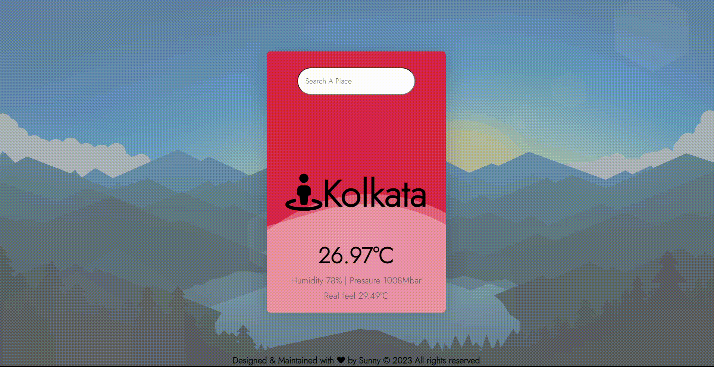

# Weather-App
Weather apps enable users to get instant alerts regarding weather conditions. Weather apps are the simplest method to know about the updates of the upcoming weather.

# Demo

<center><figcaption>Weather App Project</figcaption></center>

## Technology Used

- HTML CSS
- ReactJs
- Vite


## Running the demo

To run the demo follow these steps:

1. Clone the project with the code below.
    ```sh

    # Make sure you have the above prerequisites installed already!
    git clone https://github.com/imkss/Weather-App PROVIDER_NAME
    cd PROVIDER_NAME # Navigate to the new folder.
    npm install # Installs all the dependencies.
    ```
2. Run the app using `npm run dev`
<br/>
